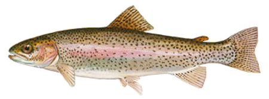
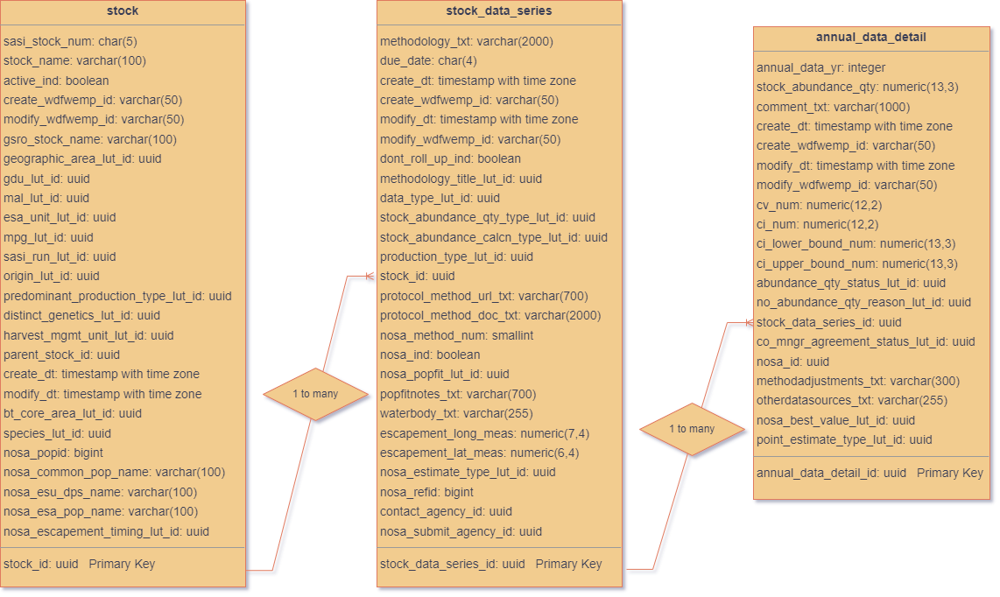

```{r setup, include=FALSE}
knitr::opts_chunk$set(echo = TRUE)

library(glue)
library(odbc)
library(DBI)
library(knitr)
library(ggthemes) # Load
library(ggplot2)
library(dplyr)
library(RODBC)
library(curl)
library(leaflet)
```

{ width=40% }

``` {r, echo = FALSE}

# Hard-code some values used across all the queries and plots

# Database and schema preferences
database_name = 'FISH'
schema_name = 'spi'
excluded_fields = "'obsolete_flag','obsolete_date', 'create_wdfwemp_id', 'create_dt','modify_dt', 'modify_wdfwemp_id'"
excluded_relnamespace = '193232, 37709, 25613, 28313,39197,44451,47323,49830,36214,1753372' # 28313,39197,,1753372,1950374 prevents duplicating rows


# Function to pull table metadata, typically used for primary data tables
table_metadata <- function(table_name) {
  con <- odbcConnect("SPI_Prod") # name of DSN; "localhost"
    metadata <- sqlQuery(con, as.is = TRUE, 
                          glue::glue(paste0("SELECT 
                            c.column_name as field_name, 
                            LOWER(c.is_nullable) as nullable, 
                            c.data_type as data_type, 
                            col_description (pgc.oid, c.ordinal_position)as description 
                            FROM information_schema.columns c 
                            INNER JOIN pg_catalog.pg_class pgc ON c.table_name = pgc.relname 
                            WHERE c.table_schema = '",schema_name,"'  
                            AND c.table_name= '",table_name,"'  
                            AND c.column_name NOT IN (", excluded_fields, ") 
                            AND pgc.relnamespace NOT IN (", excluded_relnamespace, ");")))
    
    
    close(con)
    
    colnames(metadata) <- c('FieldName','Nullable?','DataType', 'Descr')
    
    return(metadata)
    }

# Function to pull table values, typically used for look up tables
table_values <- function(table_name, fields, sort_field) {
  con <- odbcConnect("SPI_Prod") #"localhost"
    values_sql <- sqlQuery(con, as.is = TRUE, 
                          glue::glue(paste("SELECT ", fields ,
                            "FROM ", schema_name, ".", table_name ,
                            "ORDER BY ", sort_field , ";")))
    close(con)
    
    return(values_sql)
  }

# Function to table description, typically used to indicate what is stored in a core data table
table_description <- function(table_name) {
  con <- odbcConnect("SPI_Prod") #"localhost"
    table_desc <- sqlQuery(con, as.is = TRUE, 
                          glue::glue(paste("SELECT obj_description('",schema_name,".",table_name,"'::regclass);")))
    close(con)
    
    return(table_desc)
  }

# Function to count rows in a table
table_record_count <- function(table_name) {
  con <- odbcConnect("SPI_Prod") #"localhost"
    rec_count <- sqlQuery(con, as.is = TRUE, 
                          glue::glue(paste("SELECT count(*) FROM ",schema_name,".",table_name,";")))
    close(con)
    
    return(rec_count)
    }

```  


#  **Database Overview** {.tabset}
#### Disclaimer
The Salmonid Population Indicators (SPI) database is a work in progress and is subject to change.

### Salmonid Population Indicators (SPI) Database
Since its genesis as the Salmon and Steelhead Stock Inventory (SASSI) in 1992 and then the Salmonid Stock Inventory (SaSI) in 1998, the Salmonid Population Indicators (SPI) database has consisted of:

1.   A standardized, uniform approach to identifying and monitoring the status of Washington's naturally spawning salmonid populations of hatchery and natural-origin fish.
2.   The official list of salmonid populations recognized by the Washington Department of Fish and Wildlife and its co-managers.
3.   A database containing population status monitoring information and various metadata relevant to the constituent populations.

SPI is a cooperative product of the Washington Department of Fish and Wildlife and tribal co-managers and was intended to serve as a tool for prioritizing recovery efforts and measuring the results of recovery actions statewide. The co-managers' original intent was to regularly update and revise the SaSI documents and, with the 1999 creation of the Salmonid Stock Conservation Biology Unit in the Fish Program, a comprehensive updating and revision of the SaSI documents was completed in 2002. In 2022 major changes were made to SPI's database structure and a new web-based data entry application was created. Additional fields were added based on StreamNet’s Coordinated Assessments Natural Origin Spawner Abundance (CA\\NOSA) data exchange format. This latest addition is to provide a salmonid abundance dataset that contains better metadata and more monitoring parameters for more in-depth analysis.

### SPI Core Tables Schema
**What are the core tables in the SPI database?** SPI core data tables include stock, stocK_data_series, and annual_data_detail.

1.    Stock contains general descriptions and metadata about the salmonid populations within Washington. It is currently read-only and is populated by the SPI data manager.
2.    Stock data series describes the data in annual data detail. It is currently read-only and is populated by the SPI data manager.
3.    Annual data detail contains the indicator data and supporting metrics. When data providers enter data in the "Annual Data Entry" page of the SPI Web Funnel, this is where the data is stored.

<!-- Simplified diagram showing relationships of core data tables. -->
<!--[schema](SPICoreTables.png) -->
{ width=85% }

### Database statistics
**How much data is being entered in SPI?** Counts of records in specific tables are indicated in the corresponding sections later in this document. The following plot shows trends of monthly abundance data counts made since 2008.
``` {r, echo = FALSE, warning = FALSE, fig.width=8, fig.height=3}
con <- odbcConnect("SPI_Prod") #"localhost"
abundance_data <- sqlQuery(con, as.is = TRUE, 
#                      glue::glue(paste0(
#                      "SELECT 
# extract(year FROM ad.create_dt) as yr,
# extract(month FROM ad.create_dt) as mo,   
# count(annual_data_detail_id) as record_count,
# 'non-CA/NOSA' as record_type
# FROM spi.annual_data_detail ad inner join spi.stock_data_series sds on ad.stock_data_series_id = sds.stock_data_series_id
# WHERE ad.create_dt > '2007-12-31' and sds.nosa_ind = False
# GROUP BY extract(year FROM ad.create_dt),extract(month FROM ad.create_dt)
# UNION ALL 
# SELECT 
# extract(year FROM ad.create_dt) as yr,
# extract(month FROM ad.create_dt) as mo,   
# count(annual_data_detail_id) as record_count,
# 'CA/NOSA' as record_type
# FROM spi.annual_data_detail ad inner join spi.stock_data_series sds on ad.stock_data_series_id = sds.stock_data_series_id 
# WHERE ad.create_dt > '2007-12-31' and sds.nosa_ind = True  
# GROUP BY extract(year FROM ad.create_dt),extract(month FROM ad.create_dt);"
# )))

                     glue::glue(paste0(
"SELECT 
extract(year FROM ad.create_dt) as yr,
extract(month FROM ad.create_dt) as mo,   
count(annual_data_detail_id) as record_count,
'Annual_Data_Detail' as record_type
FROM spi.annual_data_detail ad inner join spi.stock_data_series sds on ad.stock_data_series_id = sds.stock_data_series_id
WHERE ad.create_dt > '2007-12-31'
GROUP BY extract(year FROM ad.create_dt),extract(month FROM ad.create_dt);"
)))

close(con)
#Convert to date, assume 15th for simplicity
abundance_data$abundance_date <- as.Date(paste0(abundance_data$yr,'-',abundance_data$mo,'-',15))
abundance_data$record_count <- as.integer(abundance_data$record_count)

p = ggplot() + 
  geom_line(data = abundance_data, aes(x = abundance_date, y = record_count, group = record_type, color=record_type), size = 1) +
  xlab('Date') +
  ylab('Record Count') +
  theme_classic() +
  scale_colour_economist()

p
```


**Where are SPI Populations located?** The following map shows where SPI Populations are located. This section is still under development!!!
```{r, echo = FALSE, warning = FALSE}
# commented out for now until an SPI map can be obtained
# con <- odbcConnect("localhost")
#     locations <- sqlQuery(con, as.is = TRUE, 
#                           glue::glue(paste0("SELECT w.water_body_desc AS water_body_name,
#                                   w.centroid_lat AS lat,
#                                   w.centroid_lon AS lon,
#                                   count(i.interview_id) AS interview_count
#                                   FROM creel.interview i
#                                   JOIN creel.creel_event e ON i.creel_event_id = e.creel_event_id
#                                   JOIN (SELECT interview_id,  
#                                     CASE WHEN fishing_location_id IS NOT NULL THEN fishing_location_id
#                                     ELSE interview_location_id END as location_id
#                                     FROM creel.interview) location_subquery ON location_subquery.interview_id = i.interview_id
#                                   JOIN creel.location_lut l ON location_subquery.location_id = l.location_id
#                                   JOIN creel.water_body_lut w ON w.water_body_id = l.water_body_id 
#                                   WHERE e.event_start_datetime >= '2021-01-01' AND w.centroid_lat IS NOT NULL
#                                   GROUP BY w.water_body_desc, w.centroid_lat, w.centroid_lon
#                                   ORDER BY count(i.interview_id) DESC;")))
#     close(con)
#     
#     locations$lat <- as.numeric(locations$lat)
#     locations$lon <- as.numeric(locations$lon)
#     locations$interview_count <- as.numeric(locations$interview_count)
# 
 m <-  leaflet() %>%
     addProviderTiles("CartoDB.Positron") #%>%
#     addCircles(lng=locations$lon, lat=locations$lat, locations$interview_count*4, popup = paste(locations$water_body_name,' | ', locations$interview_count, ' Interviews'), color="red")
# 
 m
```

### SPI Front End Application
SPI data providers can be granted access to a front end web application at: https://apps.wdfw-fish.us. This application allows users to check, add, edit, and delete abundance data. Access to data is limited to populations to which users are assigned.

### Public Data Portal
SPI data contained in this system is mirrored on the WDFW open data portal at https://www.data.wa.gov. These datasets can be accessed directly through the public web portal, or via API. Data is refreshed in this system nightly.

### Contact Information
For more information, please contact the SPI data manager Gil Lensegrav at gilbert.lensegrav@dfw.wa.gov .

#  **stock** {.tabset}
`r table_description('stock')`

Total Records: **`r table_record_count('stock')`**

``` {r, echo = FALSE, warning = FALSE}
kable(table_metadata('stock'))
``` 
#  **annual_data_detail** {.tabset}
`r table_description('annual_data_detail')`

Total Records: **`r table_record_count('annual_data_detail')`**

``` {r, echo = FALSE, warning = FALSE}
kable(table_metadata('annual_data_detail'))
```
### abundance_qty_status_lut
`r table_description('abundance_qty_status_lut')`
``` {r, echo = FALSE, warning = FALSE}
kable(table_values('abundance_qty_status_lut','abundance_qty_status_short_desc, abundance_qty_status_desc','abundance_qty_status_short_desc'),align='lll')
``` 
### no_abundance_qty_reason_lut
`r table_description('no_abundance_qty_reason_lut')`
``` {r, echo = FALSE, warning = FALSE}
kable(table_values('no_abundance_qty_reason_lut','reason_short_desc, reason_desc','reason_short_desc'),align='lll')
``` 
### co_mngr_agreement_status_lut
`r table_description('co_mngr_agreement_status_lut')`
``` {r, echo = FALSE, warning = FALSE}
kable(table_values('co_mngr_agreement_status_lut','co_mngr_agreement_status_short_desc, co_mngr_agreement_status_desc','co_mngr_agreement_status_short_desc'),align='lll')
``` 
### nosa_best_value_lut
`r table_description('nosa_best_value_lut')`
``` {r, echo = FALSE, warning = FALSE}
kable(table_values('nosa_best_value_lut','best_value_short_desc, best_value_desc','best_value_short_desc'),align='lll')
``` 
### point_estimate_type_lut
`r table_description('point_estimate_type_lut')`
``` {r, echo = FALSE, warning = FALSE}
kable(table_values('point_estimate_type_lut','point_estimate_type_short_desc, point_estimate_type_desc','point_estimate_type_short_desc'),align='lll')
``` 
#  **stock_data_series** {.tabset}
`r table_description('stock_data_series')`

Total Records: **`r table_record_count('stock_data_series')`**

``` {r, echo = FALSE, warning = FALSE}
kable(table_metadata('stock_data_series'))
```
### data_type_lut
`r table_description('data_type_lut')`
``` {r, echo = FALSE, warning = FALSE}
kable(table_values('data_type_lut','data_type_short_desc, data_type_desc','data_type_short_desc'),align='lll')
``` 
### methodology_title_lut
`r table_description('methodology_title_lut')`
``` {r, echo = FALSE, warning = FALSE}
kable(table_values('methodology_title_lut','methodology_title_short_desc, methodology_title_desc','methodology_title_short_desc'),align='lll')
``` 
### stock_abundance_qty_type_lut
`r table_description('stock_abundance_qty_type_lut')`
``` {r, echo = FALSE, warning = FALSE}
kable(table_values('stock_abundance_qty_type_lut','stock_abundance_qty_type_short_desc, stock_abundance_qty_type_desc','stock_abundance_qty_type_short_desc'),align='lll')
``` 
### stock_abundance_calcn_type_lut
`r table_description('stock_abundance_calcn_type_lut')`
``` {r, echo = FALSE, warning = FALSE}
kable(table_values('stock_abundance_calcn_type_lut','stock_abundance_calcn_type_short_desc, stock_abundance_calcn_type_desc','stock_abundance_calcn_type_short_desc'),align='lll')
``` 
### production_type_lut
`r table_description('production_type_lut')`
``` {r, echo = FALSE, warning = FALSE}
kable(table_values('production_type_lut','production_type_short_desc, production_type_desc','production_type_short_desc'),align='lll')
``` 
### nosa_popfit_lut
`r table_description('nosa_popfit_lut')`
``` {r, echo = FALSE, warning = FALSE}
kable(table_values('nosa_popfit_lut','nosa_popfit_short_desc, nosa_popfit_desc','nosa_popfit_short_desc'),align='lll')
``` 
### nosa_estimate_type_lut
`r table_description('nosa_estimate_type_lut')`
``` {r, echo = FALSE, warning = FALSE}
kable(table_values('nosa_estimate_type_lut','nosa_estimate_type_short_desc, nosa_estimate_type_desc', 'nosa_estimate_type_short_desc'),align='lll')
``` 
#  **stock_report** {.tabset}
`r table_description('stock_report')`

Total Records: **`r table_record_count('stock_report')`**

``` {r, echo = FALSE, warning = FALSE}
kable(table_metadata('stock_report'))
``` 

#  **stock_par_assignment** {.tabset}
`r table_description('stock_par_assignment')`

Total Records: **`r table_record_count('stock_par_assignment')`**

``` {r, echo = FALSE, warning = FALSE}
kable(table_metadata('stock_par_assignment'))
``` 
#  **sasi_stock_par** {.tabset}
`r table_description('sasi_stock_par')`

Total Records: **`r table_record_count('sasi_stock_par')`**

``` {r, echo = FALSE, warning = FALSE}
kable(table_metadata('sasi_stock_par'))
``` 
#  **person** {.tabset}
`r table_description('person')`

Total Records: **`r table_record_count('person')`**

``` {r, echo = FALSE, warning = FALSE}
kable(table_metadata('person'))
``` 
#  **par_email** {.tabset}
`r table_description('par_email')`

Total Records: **`r table_record_count('par_email')`**

``` {r, echo = FALSE, warning = FALSE}
kable(table_metadata('par_email'))
``` 
#  **par_address** {.tabset}
`r table_description('par_address')`

Total Records: **`r table_record_count('par_address')`**

``` {r, echo = FALSE, warning = FALSE}
kable(table_metadata('par_address'))
``` 
#  **par_phone** {.tabset}
`r table_description('par_phone')`

Total Records: **`r table_record_count('par_phone')`**

``` {r, echo = FALSE, warning = FALSE}
kable(table_metadata('par_phone'))
``` 


#  **nosa_age** {.tabset}
`r table_description('nosa_age')`

Total Records: **`r table_record_count('nosa_age')`**

``` {r, echo = FALSE, warning = FALSE}
kable(table_metadata('nosa_age'))
```  


#  **data_series_report_tag** {.tabset}
`r table_description('data_series_report_tag')`

Total Records: **`r table_record_count('data_series_report_tag')`**

``` {r, echo = FALSE, warning = FALSE}
kable(table_metadata('data_series_report_tag'))
```

#  **management_goal** {.tabset}
`r table_description('management_goal')`

Total Records: **`r table_record_count('management_goal')`**

``` {r, echo = FALSE, warning = FALSE}
kable(table_metadata('management_goal'))
```
### management_goal_type_lut
`r table_description('management_goal_type_lut')`
``` {r, echo = FALSE, warning = FALSE}
kable(table_values('management_goal_type_lut','management_goal_type_name, management_goal_type_desc','management_goal_type_name'),align='lll')
``` 

